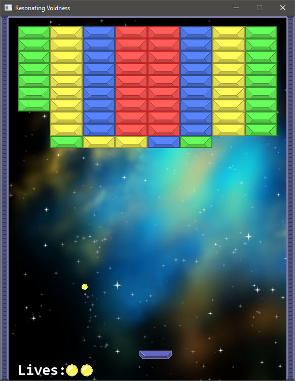

# Resonating Voidness

Arkanoid/Breakout clone. The goal of the game is to destroy all the colored bricks with the ball. The ball keeps moving and will bounce when colliding with the brick, platform or playable boundary. Player can and should control the platform to keep the ball above, otherwise player will lose one of three lives. Breaking a brick can result in spawning bonus that upon pickup will grant the player specific effect. The game keeps track of players score that will be shown and stored in the end.

## Bonuses by color

- `Blue` - increases the platform size
- `Green` - increases the platform speed
- `Red` - increases the ball speed
- `Teal` - increases the score by 100
- `Yellow` - increases the score by 200
- `Purple` - increases the score by 500

## Controls

- `Left arrow` - moves the platform to the left
- `Right arrow` - moves the platform to the right
- `Space` - releases the ball from the platform
- `Escape` - ends the game

## Maps

- `examples/maps/Map1.txt`
- `examples/maps/Map2.txt`
- `examples/maps/Map3.txt`
- `examples/maps/Map4.txt`
- `examples/maps/EasyMap0.txt`
- `examples/maps/EasyMap1.txt`
- `examples/maps/HardMap0.txt`
- `examples/maps/HardMap1.txt`

The game contains maploader and it's possible to create your own map. Created map is checked for validity - number of rows and columns, number of destroyable bricks and finishability of the map (checked using DFS).

## Credits

- Brick, border, ball & platform assets - [here](https://opengameart.org/content/breakout-game-art)
- Background - [here](https://opengameart.org/content/space-ship-construction-kit)